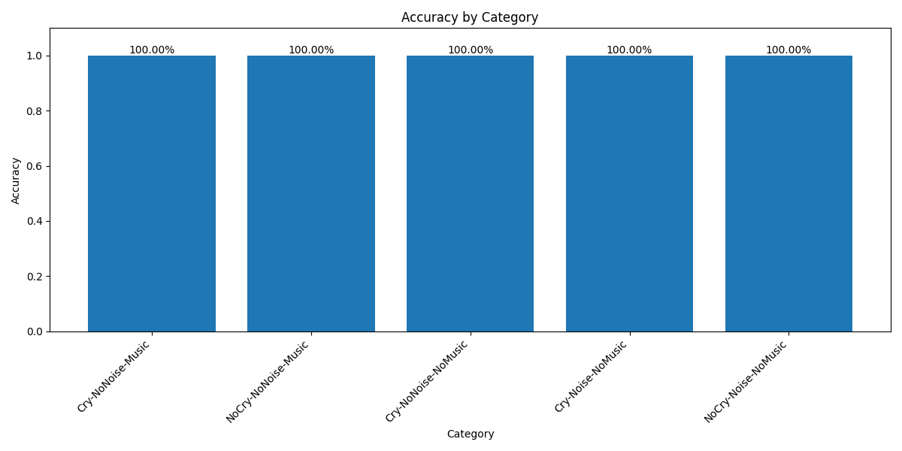
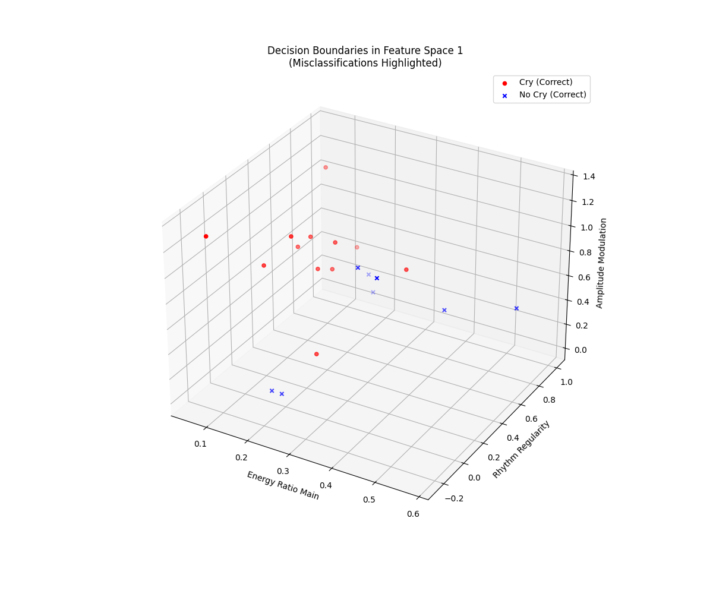
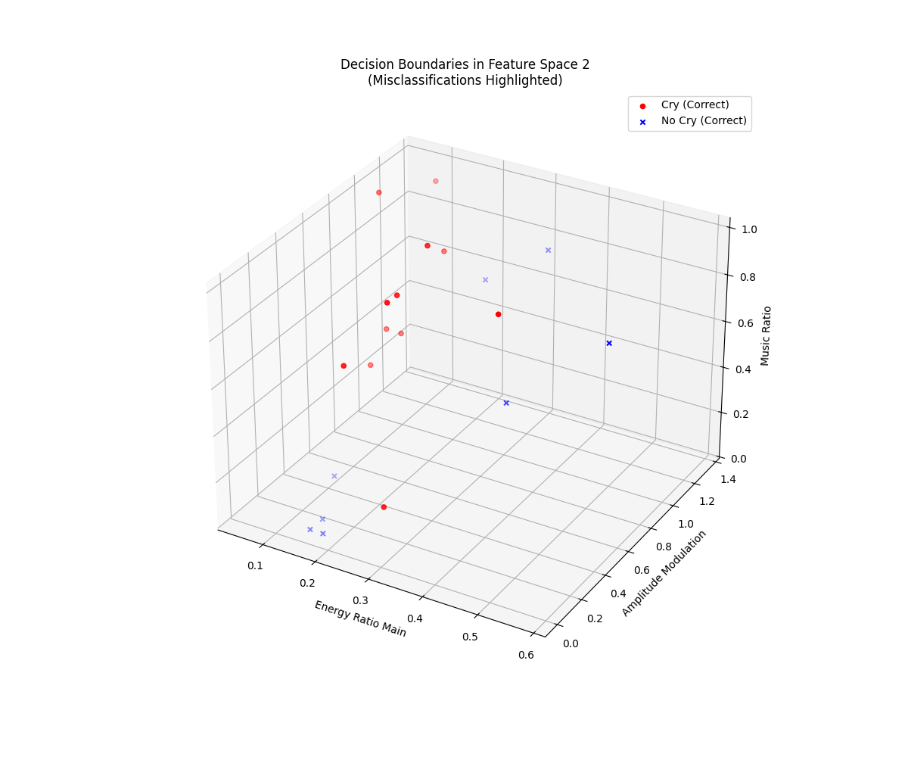
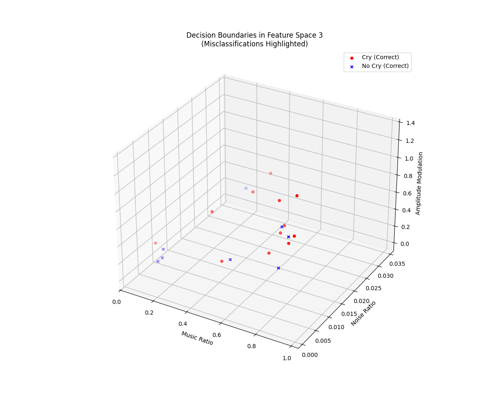
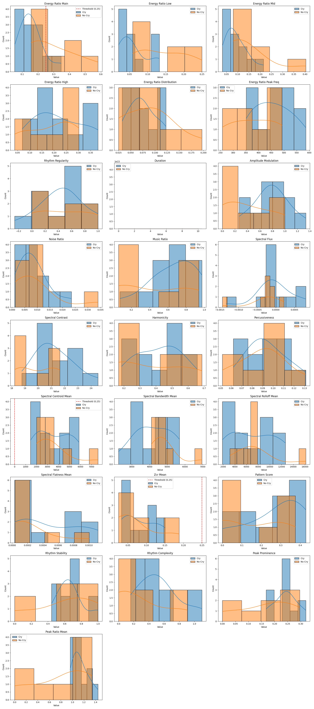
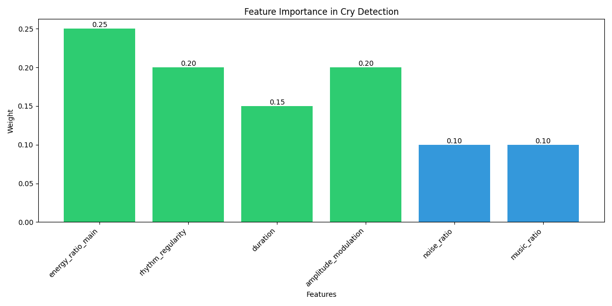

# Baby Cry Detection System 

This project implements a rule-based baby cry detection system using Python. The main problem addressed is to **detect baby cries in audio recordings even in the presence of music and noise**, without using any machine learning (ML) or deep learning (DL) models. The pipeline consists of audio preprocessing, feature extraction, and cry/no-cry decision logic based on rules and thresholds.

## Project Structure

- `audio_preprocessing.py`: Audio normalization and noise reduction.
- `feature_extraction.py`: Extraction of a wide range of audio features (energy ratios, MFCCs, rhythm, music/noise separation, etc.).
- `cry_detection.py`: Rule-based logic for cry/no-cry decision using extracted features.
- `main.py`: Orchestrates the pipeline, evaluates accuracy, and logs results.

## Setup

### 1. Clone the Repository
```bash
git clone https://github.com/saha0073/cry-detection-from-music-and-noise
cd cry-detection-from-music-and-noise
```

Install dependencies (python version used 3.12):
```bash
pip install numpy librosa scipy soundfile
```

## Pipeline Usage

### Step 1: Audio Preprocessing
Preprocess your raw audio files (e.g., `.ogg`) to normalize and reduce noise.

```bash
python audio_preprocessing.py
```
- By default, this script processes all `.ogg` files in a specified directory, normalizes them, applies noise reduction, and saves the processed files (as `.wav`) in an output directory.
- You can modify the script to set your input/output directories as needed.

### Step 2: Feature Extraction
Extract features from the preprocessed audio files.

```bash
python feature_extraction.py
```
- This script processes all `.wav` files in the `processed_audio/` directory (organized by category), extracts a comprehensive set of features, and saves them as JSON files in the `extracted_features/` directory.

### Step 3: Cry Detection & Evaluation
Run the main evaluation pipeline to apply the rule-based cry detection logic and compute accuracy metrics.

```bash
python main.py
```
- This script loads the extracted features, applies the cry detection rules (from `cry_detection.py`), and evaluates performance across different categories.
- Results and detailed logs are saved in the `results/` directory, including per-file predictions and overall accuracy metrics.

## How It Works

- **audio_preprocessing.py**: Loads audio, converts to mono, normalizes amplitude, and applies basic noise reduction using spectral subtraction.
- **feature_extraction.py**: Extracts a wide range of features (energy ratios in cry frequency bands, MFCCs, rhythm, amplitude modulation, music/noise separation, etc.) and saves them for each file.
- **cry_detection.py**: Implements a `CryDetector` class that loads thresholds, analyzes features, and applies a set of hand-crafted rules to decide if a segment contains a cry.
- **main.py**: Runs the full pipeline, applies the detector to all files, logs detailed results, and computes accuracy, precision, recall, and F1 score for each category.


## Results and Accuracy Metrics

The accuracy metrics for the cry detection system are stored in `results/accuracy_metrics.json`. This file contains the overall performance metrics (accuracy, precision, recall, F1 score) and category-wise results. For example, the system achieves an overall accuracy of 100%, with 100% precision and recall, indicating robust performance across different categories (e.g., Cry-NoNoise-Music, NoCry-NoNoise-Music, etc.).

**accuracy_metrics.json:**
```json
{
    "total_files": 20,
    "true_positives": 12,
    "true_negatives": 8,
    "false_positives": 0,
    "false_negatives": 0,
    "accuracy": 1.0,
    "precision": 1.0,
    "recall": 1.0,
    "f1_score": 1.0,
    "category_results": {
        "Cry-NoNoise-Music": {"correct": 4, "total": 4},
        "NoCry-NoNoise-Music": {"correct": 4, "total": 4},
        "Cry-NoNoise-NoMusic": {"correct": 4, "total": 4},
        "Cry-Noise-NoMusic": {"correct": 4, "total": 4},
        "NoCry-Noise-NoMusic": {"correct": 4, "total": 4}
    }
}
```

## Further Improvements

- While the current rule-based system is lightweight and suitable for edge devices, and getting 100% accuracy, this may not generalize to all real-world cases.
- For higher accuracy, consider transitioning to a machine learning or deep learning approach. Lightweight DNN models, such as MobileNetV3 and EfficientNet, are available for audio classification and could be explored for deployment on edge devices.

## Features and Decision Boundaries

The cry detection system uses a variety of audio features to make its decisions:

- **Energy Ratios**: The system analyzes the energy distribution in specific frequency bands (e.g., 250-600 Hz for cry detection) and computes ratios to determine if the audio segment contains a cry.
- **Rhythm Regularity**: Measures the regularity of amplitude peaks to identify rhythmic patterns typical of crying.
- **Amplitude Modulation**: Evaluates the variation in amplitude to distinguish between cry and non-cry segments.
- **Music and Noise Separation**: The system separates harmonic (music) and percussive (noise) components to adjust decision boundaries. For instance, if the music ratio is high, the system may apply stricter thresholds to avoid false positives.

The decision boundaries are defined by thresholds that are either calculated from training data or set to default values. These thresholds are used to determine whether a segment is classified as a cry or not. For example, if the energy ratio exceeds a certain threshold and the rhythm regularity is above a minimum value, the segment is classified as a cry.

## Visualizations and Interpretation

This project includes several visualizations to help interpret the performance and behavior of the cry detection system. You can find these plots in the `results/` folder:

### 1. Category-wise Accuracy

This bar chart shows the accuracy for each test category (e.g., Cry-NoNoise-Music, NoCry-NoNoise-Music, etc.). Each bar represents the proportion of correctly classified files in that category. In the current results, all categories achieve 100% accuracy, indicating robust and balanced performance across different audio conditions.

### 2. Decision Boundaries in Feature Space
- 
- 
- 

These 3D scatter plots visualize the distribution of audio samples in different feature spaces:
- **Decision Boundaries 1:** Plots Energy Ratio Main, Rhythm Regularity, and Amplitude Modulation. Red dots are correctly classified cries, blue crosses are correctly classified non-cries. This helps visualize how the rule-based boundaries separate the two classes.
- **Decision Boundaries 2:** Plots Energy Ratio Main, Amplitude Modulation, and Music Ratio. This view highlights how music content and amplitude modulation interact in the decision process.
- **Decision Boundaries 3:** Plots Music Ratio, Noise Ratio, and Amplitude Modulation. This helps to see how the system distinguishes between music, noise, and cry signals.

### 3. Feature Distributions

This grid of histograms and density plots shows the distribution of key features for both cry and non-cry samples. Each subplot compares the values for cries (blue) and non-cries (orange), with vertical lines indicating decision thresholds where relevant. These plots help you understand which features are most discriminative and how well the chosen thresholds separate the classes.

### 4. Feature Importance

This bar chart shows the relative importance (weight) of each feature in the cry detection decision. Features like energy ratio, rhythm regularity, amplitude modulation, and duration have the highest weights, indicating they are most influential in the rule-based logic. Noise and music ratios have lower weights but help reduce false positives in challenging cases.

These visualizations provide insight into the strengths and limitations of the current rule-based approach and can guide further improvements or the transition to a machine learning model.
